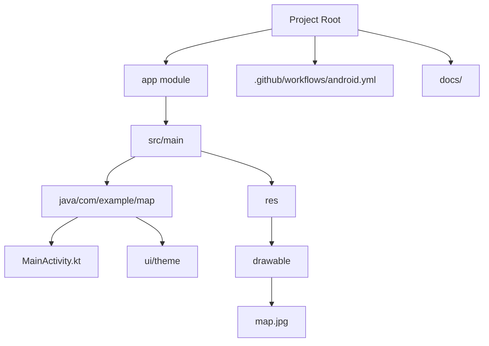

# Диаграмма файлов приложения

## Основная структура проекта

## Описание файлов
- **MainActivity.kt**: Содержит всю логику приложения: Jetpack Compose интерфейс, обработку жестов трансформации, логику работы с точками и их сохранение.
- **map.jpg**: Фоновое изображение, используемое в качестве карты.
- **android.yml**: Конфигурация GitHub Actions для автоматической сборки APK и прогона тестов.
- **docs/**: Набор Markdown-файлов для документации (GitHub Pages).
